# Database Design Summary: Project Template-Dotnet

This document summarizes the database design for "Project Template-Dotnet," covering two configurations:
* **Configuration 2**: Scalable, multi-user application with a PostgreSQL backend.
* **Configuration 1**: Local, single-user MAUI application with an SQLite backend.

All decisions herein reflect the iterative discussions and confirmations provided throughout our design process.

## 1. Summary of Key Design Choices

1.  **Project Goal**: Design database schemas for a reusable .NET 9 boilerplate project ("Project Template-Dotnet") implementing a simple product purchasing application, demonstrating Clean Architecture, DDD, and CQRS (without MediatR).
2.  **Two Configurations**:
    * **Configuration 2 (PostgreSQL)**: For a multi-user, scalable backend API supporting a MAUI client. Emphasizes robustness, data integrity, and performance.
    * **Configuration 1 (SQLite)**: For a standalone, single-user MAUI application with local data storage. Emphasizes simplicity and local efficiency.
3.  **Database Type**: SQL. PostgreSQL for Configuration 2; SQLite for Configuration 1.
4.  **ID Strategy (Config 2 Entities)**: Dual ID system:
    * `[EntityName]ID_Internal` (`INTEGER GENERATED BY DEFAULT AS IDENTITY PRIMARY KEY`) for internal relations.
    * `[EntityName]ID_External` (`UUID UNIQUE NOT NULL DEFAULT gen_random_uuid()`) for external exposure.
5.  **ID Strategy (Config 1 Entities & Config 2 Lookup Tables)**: Single `[TableName]ID` (`INTEGER PRIMARY KEY AUTOINCREMENT` for SQLite, `INTEGER GENERATED BY DEFAULT AS IDENTITY PRIMARY KEY` for PostgreSQL lookups). Lookup tables also feature a unique human-readable `Code` field (e.g., `CurrencyCode`).
6.  **Normalization**: Both configurations aim for **3rd Normal Form (3NF)** to ensure data integrity and minimize redundancy, adapted for their respective contexts.
7.  **Data Deletion & GDPR (Config 2)**:
    * **Soft Deletes**: Implemented with `IsDeleted` (Boolean) and `DeletedAt` (Timestamp) fields for key entities (`User`, `UserAddress`, `Product`, `ProductImage`, `Notification`).
    * **Filtered Uniqueness**: `UNIQUE` constraints on fields like `User.Email`, `User.Username`, and `Product.Name` are filtered (`WHERE IsDeleted = false`) to allow reuse of identifiers once an entity is soft-deleted. The `UserAddress` composite unique key is also filtered.
    * **GDPR Anonymization**: For user erasure requests, the `User` record's PII is anonymized (e.g., `Email` / `Username` set to a unique anonymized pattern like "anonymized\_user\_[UserID_Internal]"). The `User` record itself is retained (linked via `ON DELETE RESTRICT` from `Order`) to preserve historical order integrity. Associated PII in `OrderAddress` is also anonymized.
8.  **Data Deletion (Config 1)**: Hard deletes are used for simplicity. No `IsDeleted`/`DeletedAt` fields.
9.  **Text Field Handling**:
    * **Config 2 (PostgreSQL)**: Explicit `VARCHAR(n)` lengths for most text fields, `TEXT` for potentially very long content (`Product.Description`, `Notification.Message`, `OrderStatusHistory.Notes`), and `CITEXT` for case-insensitive fields involved in unique constraints (address components, `Notification.RelatedEntityType`). Lookup table `Code` fields use `CHECK (Code = UPPER(Code))`.
    * **Config 1 (SQLite)**: `TEXT` for string data, with `COLLATE NOCASE` for unique constraints requiring case-insensitivity.
10. **Test Data Generation**:
    * **Required**: For both configurations.
    * **Scales**: 10s of examples (unit/integration/demo), ~1,000 rows (light performance/list handling), and Millions of rows (Config 2 only, for extensive performance testing).
    * **Methods**:
        * 10s: EF Core data seeding, .NET library (e.g., Bogus).
        * 1000s: .NET library (e.g., Bogus).
        * Millions (Config 2): Raw SQL scripts.

## 2. Detailed Schema and Design Documentation

### 2.1. Configuration 2: PostgreSQL Schema

This schema is designed for a scalable, multi-user application using PostgreSQL. It includes 14 tables.

#### 2.1.1. Entity Relationship Diagram (Mermaid - Config 2)

```mermaid
classDiagram
    direction LR

    class Country {
        +CountryID: INTEGER (PK)
        CountryCode: VARCHAR(2) (UK, NN, CK_UPPER)
        Name: VARCHAR(100) (UK, NN)
        CreatedAt: TIMESTAMP WITH TIME ZONE (NN, DEFAULT)
        UpdatedAt: TIMESTAMP WITH TIME ZONE (NN, DEFAULT)
    }

    class Currency {
        +CurrencyID: INTEGER (PK)
        CurrencyCode: VARCHAR(3) (UK, NN, CK_UPPER)
        Name: VARCHAR(50) (NN)
        Symbol: VARCHAR(5)
        DecimalPlaces: INTEGER (NN, DEFAULT 2)
        CreatedAt: TIMESTAMP WITH TIME ZONE (NN, DEFAULT)
        UpdatedAt: TIMESTAMP WITH TIME ZONE (NN, DEFAULT)
    }

    class OrderStatusType {
        +OrderStatusTypeID: INTEGER (PK)
        Code: VARCHAR(50) (UK, NN, CK_UPPER)
        Name: VARCHAR(100) (NN)
        Description: VARCHAR(255)
        CreatedAt: TIMESTAMP WITH TIME ZONE (NN, DEFAULT)
        UpdatedAt: TIMESTAMP WITH TIME ZONE (NN, DEFAULT)
    }

    class PaymentStatusType {
        +PaymentStatusTypeID: INTEGER (PK)
        Code: VARCHAR(50) (UK, NN, CK_UPPER)
        Name: VARCHAR(100) (NN)
        Description: VARCHAR(255)
        CreatedAt: TIMESTAMP WITH TIME ZONE (NN, DEFAULT)
        UpdatedAt: TIMESTAMP WITH TIME ZONE (NN, DEFAULT)
    }

    class User {
        +UserID_Internal: INTEGER (PK)
        UserID_External: UUID (UK, NN, DEFAULT)
        Username: VARCHAR(50) (NN) -- UK_FILTERED (WHERE IsDeleted = false)
        Email: VARCHAR(254) (NN) -- UK_FILTERED (WHERE IsDeleted = false)
        FirstName: VARCHAR(100)
        LastName: VARCHAR(100)
        IsDeleted: BOOLEAN (NN, DEFAULT false)
        DeletedAt: TIMESTAMP WITH TIME ZONE
        CreatedAt: TIMESTAMP WITH TIME ZONE (NN, DEFAULT)
        UpdatedAt: TIMESTAMP WITH TIME ZONE (NN, DEFAULT)
    }

    class UserAddress {
        +UserAddressID_Internal: INTEGER (PK)
        UserAddressID_External: UUID (UK, NN, DEFAULT)
        UserID_Internal: INTEGER (FK to User, NN, ON DELETE CASCADE)
        Street: CITEXT (NN)
        City: CITEXT (NN)
        StateProvince: VARCHAR(100)
        PostalCode: CITEXT (NN)
        CountryID: INTEGER (FK to Country, NN)
        IsDefaultShipping: BOOLEAN (NN, DEFAULT false) -- UK_FILTERED (UserID_Internal) WHERE IsDefaultShipping = true
        IsDefaultBilling: BOOLEAN (NN, DEFAULT false) -- UK_FILTERED (UserID_Internal) WHERE IsDefaultBilling = true
        IsDeleted: BOOLEAN (NN, DEFAULT false)
        DeletedAt: TIMESTAMP WITH TIME ZONE
        CreatedAt: TIMESTAMP WITH TIME ZONE (NN, DEFAULT)
        UpdatedAt: TIMESTAMP WITH TIME ZONE (NN, DEFAULT)
        -- Composite UK: (UserID_Internal, Street, City, PostalCode, CountryID) WHERE IsDeleted = false
    }

    class Product {
        +ProductID_Internal: INTEGER (PK)
        ProductID_External: UUID (UK, NN, DEFAULT)
        Name: VARCHAR(255) (NN) -- UK_FILTERED (WHERE IsDeleted = false)
        Description: TEXT
        PriceAmount: DECIMAL(19,4) (NN, CK > 0)
        CurrencyID: INTEGER (FK to Currency, NN)
        IsAvailable: BOOLEAN (NN, DEFAULT false)
        IsDeleted: BOOLEAN (NN, DEFAULT false)
        DeletedAt: TIMESTAMP WITH TIME ZONE
        CreatedAt: TIMESTAMP WITH TIME ZONE (NN, DEFAULT)
        UpdatedAt: TIMESTAMP WITH TIME ZONE (NN, DEFAULT)
        -- CK: (IsDeleted = false OR IsAvailable = false)
    }

    class ProductImage {
        +ProductImageID_Internal: INTEGER (PK)
        ProductImageID_External: UUID (UK, NN, DEFAULT)
        ProductID_Internal: INTEGER (FK to Product, NN, ON DELETE CASCADE)
        ImageUrl: VARCHAR(2048) (NN)
        AltText: VARCHAR(255) (NN)
        DisplayOrder: INTEGER (NN, DEFAULT 0)
        IsDeleted: BOOLEAN (NN, DEFAULT false)
        DeletedAt: TIMESTAMP WITH TIME ZONE
        CreatedAt: TIMESTAMP WITH TIME ZONE (NN, DEFAULT)
        UpdatedAt: TIMESTAMP WITH TIME ZONE (NN, DEFAULT)
        -- UK: (ProductID_Internal, DisplayOrder)
    }

    class OrderAddress {
        +OrderAddressID_Internal: INTEGER (PK)
        OrderAddressID_External: UUID (UK, NN, DEFAULT)
        Street: CITEXT (NN)
        City: CITEXT (NN)
        StateProvince: VARCHAR(100)
        PostalCode: CITEXT (NN)
        CountryID: INTEGER (FK to Country, NN)
        CreatedAt: TIMESTAMP WITH TIME ZONE (NN, DEFAULT)
        UpdatedAt: TIMESTAMP WITH TIME ZONE (NN, DEFAULT)
    }

    class Order {
        +OrderID_Internal: INTEGER (PK)
        OrderID_External: UUID (UK, NN, DEFAULT)
        UserID_Internal: INTEGER (FK to User, NN, ON DELETE RESTRICT)
        OrderNumber: VARCHAR(50) (UK, NN)
        OrderDate: TIMESTAMP WITH TIME ZONE (NN, DEFAULT) -- App can override default
        OrderStatusTypeID: INTEGER (FK to OrderStatusType, NN, DEFAULT 'DRAFT_ID')
        TotalAmount: DECIMAL(19,4) (NN, CK >= 0)
        CurrencyID: INTEGER (FK to Currency, NN)
        ShippingAddressID_Internal: INTEGER (FK to OrderAddress)
        BillingAddressID_Internal: INTEGER (FK to OrderAddress, NULLABLE) -- App logic makes NN before validation
        CreatedAt: TIMESTAMP WITH TIME ZONE (NN, DEFAULT)
        UpdatedAt: TIMESTAMP WITH TIME ZONE (NN, DEFAULT)
    }

    class OrderItem {
        +OrderItemID_Internal: INTEGER (PK)
        OrderItemID_External: UUID (UK, NN, DEFAULT)
        OrderID_Internal: INTEGER (FK to Order, NN, ON DELETE CASCADE)
        ProductID_Internal: INTEGER (FK to Product, NN, ON DELETE RESTRICT)
        Quantity: INTEGER (NN, CK > 0, DEFAULT 1)
        UnitPriceAmount: DECIMAL(19,4) (NN, CK > 0)
        UnitPriceCurrencyID: INTEGER (FK to Currency, NN)
        OriginalProductPriceAmount: DECIMAL(19,4) (NN, CK > 0)
        OriginalProductPriceCurrencyID: INTEGER (FK to Currency, NN)
        TotalItemPrice: DECIMAL(19,4) (NN, CK >=0)
        CreatedAt: TIMESTAMP WITH TIME ZONE (NN, DEFAULT)
        UpdatedAt: TIMESTAMP WITH TIME ZONE (NN, DEFAULT)
    }

    class Payment {
        +PaymentID_Internal: INTEGER (PK)
        PaymentID_External: UUID (UK, NN, DEFAULT)
        OrderID_Internal: INTEGER (FK to Order, NN, UK, ON DELETE CASCADE)
        PaymentDate: TIMESTAMP WITH TIME ZONE (NN, DEFAULT)
        Amount: DECIMAL(19,4) (NN, CK > 0)
        CurrencyID: INTEGER (FK to Currency, NN)
        PaymentMethodDetails: VARCHAR(255)
        PaymentStatusTypeID: INTEGER (FK to PaymentStatusType, NN) -- Set explicitly by app
        TransactionID: VARCHAR(255)
        CreatedAt: TIMESTAMP WITH TIME ZONE (NN, DEFAULT)
        UpdatedAt: TIMESTAMP WITH TIME ZONE (NN, DEFAULT)
    }

    class OrderStatusHistory {
        +OrderStatusHistoryID_Internal: INTEGER (PK)
        OrderStatusHistoryID_External: UUID (UK, NN, DEFAULT)
        OrderID_Internal: INTEGER (FK to Order, NN, ON DELETE CASCADE)
        OrderStatusTypeID: INTEGER (FK to OrderStatusType, NN)
        ChangedAt: TIMESTAMP WITH TIME ZONE (NN, DEFAULT)
        Notes: TEXT
        CreatedAt: TIMESTAMP WITH TIME ZONE (NN, DEFAULT)
        UpdatedAt: TIMESTAMP WITH TIME ZONE (NN, DEFAULT)
    }

    class Notification {
        +NotificationID: INTEGER (PK)
        UserID_Internal: INTEGER (FK to User, NN, ON DELETE CASCADE)
        Message: TEXT (NN)
        IsRead: BOOLEAN (NN, DEFAULT false)
        RelatedEntityID_External: UUID
        RelatedEntityType: CITEXT -- e.g., "ORDER", "PRODUCT"
        IsDeleted: BOOLEAN (NN, DEFAULT false)
        DeletedAt: TIMESTAMP WITH TIME ZONE
        CreatedAt: TIMESTAMP WITH TIME ZONE (NN, DEFAULT)
        UpdatedAt: TIMESTAMP WITH TIME ZONE (NN, DEFAULT)
    }

    User "1" -- "0..*" UserAddress : "has address book entry"
    UserAddress "many" -- "1" Country : "is in country"
    User "1" -- "0..*" Order : "places"
    User "1" -- "0..*" Notification : "receives"

    Product "1" -- "0..*" ProductImage : "has image"
    Product "1" -- "1" Currency : "priced in"

    Order "1" -- "0..*" OrderItem : "contains"
    Order "1" -- "1" OrderStatusType : "has status"
    Order "1" -- "1" Currency : "is in currency"
    Order "1" -- "0..1" OrderAddress : "ships to (ShippingAddressID_Internal)"
    Order "1" -- "0..1" OrderAddress : "billed to (BillingAddressID_Internal)"
    Order "1" -- "0..1" Payment : "has payment"
    Order "1" -- "0..*" OrderStatusHistory : "has status history"

    OrderItem "many" -- "1" Product : "is for product"
    OrderItem "many" -- "1" Currency : "unit price currency (UnitPriceCurrencyID)"
    OrderItem "many" -- "1" Currency : "original price currency (OriginalProductPriceCurrencyID)"

    Payment "1" -- "1" Currency : "is in currency"
    Payment "1" -- "1" PaymentStatusType : "has payment status"
```

#### 2.1.2. Data Normalization Plan (Config 2)
The schema for Configuration 2 adheres to the **3rd Normal Form (3NF)**.
* **1NF**: All column values are atomic.
* **2NF**: All non-key attributes are fully functionally dependent on their primary key.
* **3NF**: There are no transitive dependencies of non-key attributes on the primary key.
This approach minimizes data redundancy, avoids update/delete anomalies, and ensures data integrity, which is crucial for a scalable transactional system. Denormalization for read performance would be considered for separate read models if a full CQRS pattern is implemented later, but the primary database maintains 3NF.

#### 2.1.3. Indexing Strategy (Config 2)
To ensure optimal query performance, the following indexing strategy will be employed:
* **Primary Keys (PK)**: Automatically indexed. `[EntityName]ID_Internal` (Integer) serves as the PK for efficient internal joins.
* **Unique Constraints (UK)**: Automatically indexed. This includes:
    * `[EntityName]ID_External` (UUID) on all entities.
    * `User.Username` (filtered `WHERE IsDeleted = false`).
    * `User.Email` (filtered `WHERE IsDeleted = false`).
    * `Product.Name` (filtered `WHERE IsDeleted = false`).
    * `ProductImage` composite key (`ProductID_Internal`, `DisplayOrder`).
    * `UserAddress` composite key (`UserID_Internal`, `Street`, `City`, `PostalCode`, `CountryID`, filtered `WHERE IsDeleted = false`), and filtered unique indexes for `IsDefaultShipping`/`IsDefaultBilling`.
    * `Order.OrderNumber`.
    * `Payment.OrderID_Internal`.
    * `Code` fields in all lookup tables (`Country.CountryCode`, `Currency.CurrencyCode`, `OrderStatusType.Code`, `PaymentStatusType.Code`).
* **Foreign Keys (FK)**: All foreign key columns should be indexed to optimize join performance and referential integrity checks. This includes fields like `Product.CurrencyID`, `Order.UserID_Internal`, `Order.OrderStatusTypeID`, `OrderItem.OrderID_Internal`, `OrderItem.ProductID_Internal`, etc.
* **Frequently Searched/Filtered/Sorted Columns**: Additional indexes should be considered for:
    * `Product`: `IsAvailable`, `PriceAmount`, `CreatedAt`.
    * `Order`: `OrderDate`, `UserID_Internal` (already FK), `OrderStatusTypeID` (already FK).
    * `Notification`: `UserID_Internal` (already FK), `IsRead`, `CreatedAt`.
* **CITEXT Fields**: PostgreSQL's `CITEXT` columns (`UserAddress.Street`, `UserAddress.City`, `UserAddress.PostalCode`, `Notification.RelatedEntityType`) can be indexed normally and will support case-insensitive operations efficiently.
* **Timestamp Fields**: Fields like `CreatedAt`, `OrderDate` are often used in range queries and benefit from indexing.

#### 2.1.4. Data Deletion and GDPR Compliance Strategy (Config 2)

A multi-layered strategy is adopted for data deletion and GDPR compliance:

* **Soft Deletes**:
    * **Implementation**: Key entities (`User`, `UserAddress`, `Product`, `ProductImage`, `Notification`) include:
        * `IsDeleted (BOOLEAN NOT NULL DEFAULT false)`
        * `DeletedAt (TIMESTAMP WITH TIME ZONE NULLABLE)`
    * **Process**: When an entity is "soft-deleted," the application sets `IsDeleted = true` and `DeletedAt = CURRENT_TIMESTAMP`. Queries for active data must filter `WHERE IsDeleted = false`.
    * **Rationale**: Allows for deactivation of records without physical removal, preserving historical data and referential integrity for dependent records (like orders referencing a now soft-deleted product). It also supports potential "undelete" functionality. Application logic ensures consistency (e.g., `DeletedAt` is set/nulled with `IsDeleted`).
    * **Cascading Soft Deletes**: Application logic should handle cascading soft deletes where appropriate (e.g., soft-deleting a `User` should also soft-delete their `UserAddress` entries and `Notification`s; soft-deleting a `Product` should soft-delete its `ProductImage`s).

* **User Data Anonymization (GDPR Right to Erasure)**:
    * **Objective**: To permanently remove or de-identify a user's Personally Identifiable Information (PII) upon a verified request, while maintaining the integrity of historical transactional data (like orders).
    * **Process**:
        1.  The `User` record itself is *not* physically deleted if associated with historical orders (due to `ON DELETE RESTRICT` from `Order.UserID_Internal`).
        2.  PII fields within the `User` record are overwritten with anonymized, non-identifiable data. For example:
            * `FirstName` = "Anonymous"
            * `LastName` = "User"
            * `Email` = `"anonymized_" + UserID_Internal + "@example.com"` (ensuring uniqueness)
            * `Username` = `"anonymized_user_" + UserID_Internal` (ensuring uniqueness)
        3.  The `User.IsDeleted` flag is set to `true`, and `DeletedAt` is populated.
        4.  Associated PII in `OrderAddress` records linked to the user's past orders must also be anonymized by overwriting fields like `Street`, `City`, `PostalCode` with generic, non-identifiable values.
        5.  `UserAddress` book entries linked to the user are physically deleted due to `ON DELETE CASCADE` if the (now anonymized and soft-deleted) `User` record were ever physically deleted (though this is unlikely if orders exist). If not physically deleting the user shell, these `UserAddress` entries would be soft-deleted when the user is soft-deleted.
    * **Rationale**: This approach balances the right to erasure with the need to maintain non-PII aspects of historical records for business reporting, auditing, and system integrity.

* **Hard Deletes**:
    * Physical deletion of records is generally avoided for entities with historical significance or dependencies (like `User` with orders, `Product` with order items).
    * For child entities where `ON DELETE CASCADE` is specified (e.g., `ProductImage` on `Product` deletion, `OrderItem` on `Order` deletion, `UserAddress` on `User` physical deletion), hard deletion occurs if the parent is hard-deleted.
    * The primary mechanism for removing user PII is anonymization combined with soft delete of the user profile.

* **Filtered Unique Constraints**:
    * `User.Email`, `User.Username`, `Product.Name`, and the composite key on `UserAddress` use filtered unique indexes (`WHERE IsDeleted = false`). This allows identifiers to be reused by new, active entities if the original entity holding that identifier is soft-deleted. This interacts with the anonymization strategy: an anonymized user's original email/username becomes available if those fields are changed to the unique anonymized pattern.

### 2.2. Configuration 1: SQLite Schema

This schema is designed for a local, single-user MAUI application using SQLite. It includes 10 tables and emphasizes simplicity. Hard deletes are the standard.

#### 2.2.1. Entity Relationship Diagram (Mermaid - Config 1)

```mermaid
classDiagram
    direction LR

    class Country {
        +CountryID: INTEGER (PK AUTOINCREMENT)
        CountryCode: TEXT (UK, NN, COLLATE NOCASE)
        Name: TEXT (UK, NN, COLLATE NOCASE)
    }

    class Currency {
        +CurrencyID: INTEGER (PK AUTOINCREMENT)
        CurrencyCode: TEXT (UK, NN, COLLATE NOCASE)
        Name: TEXT (NN)
        Symbol: TEXT
        DecimalPlaces: INTEGER (NN, DEFAULT 2)
    }

    class OrderStatusType {
        +OrderStatusTypeID: INTEGER (PK AUTOINCREMENT)
        Code: TEXT (UK, NN, COLLATE NOCASE)
        Name: TEXT (NN)
        Description: TEXT
    }

    class PaymentStatusType {
        +PaymentStatusTypeID: INTEGER (PK AUTOINCREMENT)
        Code: TEXT (UK, NN, COLLATE NOCASE)
        Name: TEXT (NN)
        Description: TEXT
    }

    class Product {
        +ProductID: INTEGER (PK AUTOINCREMENT)
        Name: TEXT (UK, NN, COLLATE NOCASE)
        Description: TEXT
        PriceAmount: REAL (NN, CK > 0)
        CurrencyID: INTEGER (FK to Currency, NN)
        IsAvailable: NUMERIC (NN, DEFAULT 0)
        CreatedAt: NUMERIC (NN, DEFAULT CURRENT_TIMESTAMP)
        UpdatedAt: NUMERIC (NN, DEFAULT CURRENT_TIMESTAMP)
    }

    class ProductImage {
        +ProductImageID: INTEGER (PK AUTOINCREMENT)
        ProductID: INTEGER (FK to Product, NN, ON DELETE CASCADE)
        ImageUrl: TEXT (NN)
        AltText: TEXT (NULLABLE)
        DisplayOrder: INTEGER (NN, DEFAULT 0)
        CreatedAt: NUMERIC (NN, DEFAULT CURRENT_TIMESTAMP)
        UpdatedAt: NUMERIC (NN, DEFAULT CURRENT_TIMESTAMP)
        -- UK: (ProductID, DisplayOrder)
    }

    class OrderAddress {
        +OrderAddressID: INTEGER (PK AUTOINCREMENT)
        Street: TEXT (NN)
        City: TEXT (NN)
        StateProvince: TEXT
        PostalCode: TEXT (NN)
        CountryID: INTEGER (FK to Country, NN)
        CreatedAt: NUMERIC (NN, DEFAULT CURRENT_TIMESTAMP)
        UpdatedAt: NUMERIC (NN, DEFAULT CURRENT_TIMESTAMP)
    }

    class Order {
        +OrderID: INTEGER (PK AUTOINCREMENT)
        OrderNumber: TEXT (UK, NN, COLLATE NOCASE)
        OrderDate: NUMERIC (NN, DEFAULT CURRENT_TIMESTAMP) -- App can override
        OrderStatusTypeID: INTEGER (FK to OrderStatusType, NN, DEFAULT 'DRAFT_ID')
        TotalAmount: REAL (NN, CK >= 0)
        CurrencyID: INTEGER (FK to Currency, NN)
        ShippingAddressID: INTEGER (FK to OrderAddress, NULLABLE, ON DELETE SET NULL)
        BillingAddressID: INTEGER (FK to OrderAddress, NULLABLE, ON DELETE SET NULL) -- App logic makes NN before validation
        CreatedAt: NUMERIC (NN, DEFAULT CURRENT_TIMESTAMP)
        UpdatedAt: NUMERIC (NN, DEFAULT CURRENT_TIMESTAMP)
    }

    class OrderItem {
        +OrderItemID: INTEGER (PK AUTOINCREMENT)
        OrderID: INTEGER (FK to Order, NN, ON DELETE CASCADE)
        ProductID: INTEGER (FK to Product, NN, ON DELETE RESTRICT)
        Quantity: INTEGER (NN, CK > 0, DEFAULT 1)
        UnitPriceAmount: REAL (NN, CK > 0)
        UnitPriceCurrencyID: INTEGER (FK to Currency, NN)
        OriginalProductPriceAmount: REAL (NN, CK > 0)
        OriginalProductPriceCurrencyID: INTEGER (FK to Currency, NN)
        TotalItemPrice: REAL (NN, CK >=0)
        CreatedAt: NUMERIC (NN, DEFAULT CURRENT_TIMESTAMP)
        UpdatedAt: NUMERIC (NN, DEFAULT CURRENT_TIMESTAMP)
    }

    class Payment {
        +PaymentID: INTEGER (PK AUTOINCREMENT)
        OrderID: INTEGER (FK to Order, NN, UK, ON DELETE CASCADE)
        PaymentDate: NUMERIC (NN, DEFAULT CURRENT_TIMESTAMP)
        Amount: REAL (NN, CK > 0)
        CurrencyID: INTEGER (FK to Currency, NN)
        PaymentMethodDetails: TEXT
        PaymentStatusTypeID: INTEGER (FK to PaymentStatusType, NN) -- Set explicitly by app
        TransactionID: TEXT
        CreatedAt: NUMERIC (NN, DEFAULT CURRENT_TIMESTAMP)
        UpdatedAt: NUMERIC (NN, DEFAULT CURRENT_TIMESTAMP)
    }

    class OrderStatusHistory {
        +OrderStatusHistoryID: INTEGER (PK AUTOINCREMENT)
        OrderID: INTEGER (FK to Order, NN, ON DELETE CASCADE)
        OrderStatusTypeID: INTEGER (FK to OrderStatusType, NN)
        ChangedAt: NUMERIC (NN, DEFAULT CURRENT_TIMESTAMP)
        Notes: TEXT
        CreatedAt: NUMERIC (NN, DEFAULT CURRENT_TIMESTAMP)
        UpdatedAt: NUMERIC (NN, DEFAULT CURRENT_TIMESTAMP)
    }

    OrderAddress "1" -- "1" Country : "located in"
    Product "1" -- "1" Currency : "priced in"
    Product "1" -- "0..*" ProductImage : "has"

    Order "1" -- "0..*" OrderItem : "contains"
    Order "1" -- "1" OrderStatusType : "has status"
    Order "1" -- "1" Currency : "is in currency"
    Order "0..1" -- "1" OrderAddress : "ships to" (ShippingAddressID)
    Order "0..1" -- "1" OrderAddress : "billed to" (BillingAddressID)
    Order "1" -- "0..1" Payment : "has" (OrderID on Payment is UK)
    Order "1" -- "0..*" OrderStatusHistory : "has history"

    OrderItem "many" -- "1" Product : "is for product"
    OrderItem "many" -- "1" Currency : "unit price currency (UnitPriceCurrencyID)"
    OrderItem "many" -- "1" Currency : "original price currency (OriginalProductPriceCurrencyID)"

    Payment "1" -- "1" Currency : "is in currency"
    Payment "1" -- "1" PaymentStatusType : "has payment status"
```

#### 2.2.2. Data Normalization Plan (Config 1)
The schema for Configuration 1 also aims for **3rd Normal Form (3NF)**, adapted for its simpler single-user context.
* This ensures data consistency and clarity even in the local SQLite database.
* Simplifications (e.g., no `User` table, hard deletes) reduce complexity but the principles of minimizing redundancy and ensuring data integrity through normalization are maintained.

#### 2.2.3. Indexing Strategy (Config 1)
For SQLite in Configuration 1:
* **Primary Keys (PK)**: Automatically indexed.
* **Unique Constraints (UK)**: Automatically indexed (e.g., `Product.Name COLLATE NOCASE`, `Order.OrderNumber COLLATE NOCASE`).
* **Foreign Keys (FK)**: SQLite automatically creates indexes for foreign keys if they are not otherwise indexed *only if foreign key constraints are enabled*. It's good practice to explicitly create indexes on FKs if they are frequently used in `WHERE` clauses or joins for optimal performance, even in SQLite.
* **Frequently Searched/Filtered/Sorted Columns**: Similar to Config 2, fields like `Product.Name`, `Product.IsAvailable`, `Order.OrderStatusTypeID`, `Order.OrderDate` may benefit from explicit indexes if query performance becomes a concern, although the impact is lower with smaller local datasets.

#### 2.2.4. Data Deletion Strategy (Config 1)
* **Hard Deletes**: For simplicity in the single-user, local context, Configuration 1 uses hard deletes. There are no `IsDeleted` or `DeletedAt` fields in the tables. When a record is deleted, it is physically removed from the database.
* **Cascade Behavior**: `ON DELETE CASCADE` is used for child entities that are wholly dependent on their parent (e.g., `ProductImage` on `Product` deletion, `OrderItem` on `Order` deletion). `ON DELETE RESTRICT` is used where deletion of a parent should be prevented if children exist (e.g., `Product` if `OrderItem`s reference it). `ON DELETE SET NULL` is used for optional relationships like `Order.ShippingAddressID`. Application logic is responsible for deleting an `OrderAddress` record when its associated `Order` is deleted.

### 2.3. Test Data Generation Plan (Fixtures)

This plan outlines how test and demonstration data will be generated for the project.

* **General Principle**: The project will utilize fake data generators and seeding mechanisms appropriate for the .NET ecosystem and the scale of data required.

* **Small Scale Data (10s of examples - Config 1 & 2)**
    * **Purpose**: Unit tests, integration tests, basic UI demonstrations, initial lookup table population.
    * **Methods**:
        1.  **Entity Framework Core Data Seeding**: To be used for populating static lookup tables (`Country`, `Currency`, `OrderStatusType`, `PaymentStatusType`) with a predefined set of values during database initialization.
        2.  **.NET Data Generation Library (e.g., Bogus)**: To be used within test projects or dedicated seeding utilities (in the Infrastructure layer, aligning with Clean Architecture) to create a small, controlled set of realistic fake data for entities like `Product`, `Order` (and `User` for Config 2). This allows for varied and representative test cases.
    * **Instructions**:
        * Define seed data for lookup tables directly in EF Core migration configurations or a seeding module.
        * Develop test helper methods or factories using a library like Bogus to generate instances of main entities with realistic fake data for use in automated tests and initial demos.

* **Medium Scale Data (~1,000 rows - Config 1 & 2)**
    * **Purpose**: Light performance testing, demonstrating UI list handling (pagination, scrolling) with more substantial data, providing a richer demonstration environment.
    * **Method**: **.NET Data Generation Library (e.g., Bogus)**.
    * **Instructions**:
        * Create a utility or script within the project (possibly a CLI command or a dedicated seeding class callable by the application) that uses the chosen .NET library to generate approximately 1,000 rows for key transactional tables like `Product`, `Order`, `OrderItem` (and `User` for Config 2).
        * This utility should ensure generated data maintains referential integrity.
        * Developers can invoke this utility to populate their development/test databases.

* **Large Scale Data (Millions of rows - Config 2 only)**
    * **Purpose**: More intensive performance testing, production simulation for scalability assessments of the PostgreSQL backend.
    * **Method**: **Raw SQL scripts** (bulk `INSERT` statements).
    * **Instructions**:
        * The template will not provide millions of rows of data directly. Instead, it should provide guidance or a simple utility/script (potentially written in C# or another scripting language) capable of *generating* large SQL `INSERT` script files.
        * This generator should output data that respects data types, constraints, and referential integrity for the Config 2 schema.
        * The generated SQL script(s) can then be executed directly against the PostgreSQL database using tools like `psql` for efficient bulk loading.
        * Considerations for disabling/re-enabling indexes and constraints during bulk load might be part of the guidance for very large datasets.

## 3. Detailed Deletion strategy

This is a multi-faceted requirement. Here's how we'll approach it in the schema, along with an explanation:

### 3.1. Soft Delete (Operational Deletion):

Purpose: Allows marking records as "deleted" without physically removing them from the database. This is useful for accidental deletions (allowing undelete), maintaining history for audit purposes, or deactivating entities while preserving related data integrity.
Implementation: We will add two fields to key entities that typically have a lifecycle managed by users or business processes:
    IsDeleted (Boolean, NOT NULL, Default: false)
    DeletedAt (TIMESTAMP WITH TIME ZONE, Nullable)
Affected Entities (for Config 2): User, UserAddress, Product (using IsAvailable can be part of this, but a dedicated IsDeleted is clearer for actual deletion intent), Order (though orders usually go to Cancelled or Archived statuses rather than soft delete, let's discuss if Order needs this specifically or if status is enough), ProductImage, Notification. Payment and OrderItem are usually tied to an Order's lifecycle. OrderStatusHistory is an audit log itself.
How it works: When a user "deletes" something (e.g., their address book entry), the application sets IsDeleted = true and DeletedAt = CURRENT_TIMESTAMP. Queries for active data will then need to include WHERE IsDeleted = false.

### 3.2. Hard Delete (GDPR Right to Erasure):

Purpose: To comply with data privacy regulations like GDPR, which give individuals the right to have their personal data permanently erased.
Implementation: This is more than just a schema change; it's a process. The schema supports it by allowing PII (Personally Identifiable Information) to be identified and removed.
    Identifying PII: Fields like User.Email, User.FirstName, User.LastName, User.Username, and any address details in UserAddress and OrderAddress are PII.
    Process for Hard Delete:
        Request & Verification: User requests deletion; identity is verified.
        Data Anonymization/Deletion:
            For the User record itself: PII fields can be overwritten with anonymized values (e.g., Email = "deleteduser_xyz@example.com", Name = "Anonymous User") or the record physically deleted if no integrity constraints prevent it.
            Related Data (UserAddress, Notification linked to the user): These can be physically deleted.
            Critical Consideration - Orders: Orders placed by the user contain PII (e.g., shipping address in OrderAddress, potentially user's name if denormalized). Physically deleting a User record when they have Orders would violate referential integrity if Order.UserID_Internal is a mandatory FK.
                Strategy for Orders: Instead of deleting the User record that has orders, the User record is anonymized. Order.UserID_Internal would still point to this anonymized user record. The PII in OrderAddress associated with those orders would also need to be anonymized or handled according to business rules (e.g., retained for legal/financial reasons for a certain period but access restricted).
                Physically deleting Order records is usually not done due to financial and audit requirements. Instead, the link to the identifiable user is severed by anonymizing the PII on the User record and associated OrderAddress PII.
    Schema Support: Our schema, by having UserID_Internal on Order, allows us to find all orders for a user. By having separate OrderAddress, we can target the PII there.
Important: The template will provide the schema hooks (like IsDeleted flags). The full implementation of the hard delete/anonymization process (including handling data in backups, logs, etc.) is a significant application-level and operational task beyond just the schema design, but the schema will be designed not to obstruct it.

### 3.3. Best Practice & Implementation for OrderAddress

Standard text fields in OrderAddress (e.g., Street, City, PostalCode) are sufficient for PII.
When a User's PII is anonymized (due to a GDPR erasure request), the process involves:
    * Anonymizing PII fields in the User record itself (e.g., Email = "anonymous+[UserID_Internal]@example.com", FirstName = "Anonymous", LastName = "User", Username = "anonymous_[UserID_Internal]"). The User record itself (with its UserID_Internal) is typically not physically deleted if they have orders, to maintain historical data integrity.
    * Identifying all OrderAddress records linked to orders placed by this user.
    * For each of these OrderAddress records, the PII fields (Street, City, PostalCode, etc.) are overwritten with generic, non-identifiable values (e.g., "ANONYMIZED DATA").
The schema supports this by allowing these text fields to be updated. No special IsAnonymized flag is typically required on OrderAddress for V1, as the anonymization state is primarily determined by the linked (and now anonymized) User record and the data content itself.